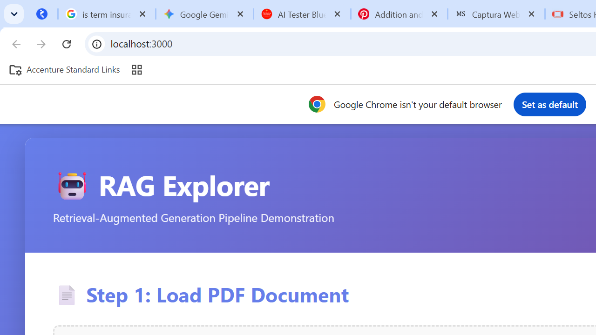

# RAG Explorer - Complete Setup Guide

## 📋 Overview

**RAG Explorer** is a demonstration application that showcases how a Retrieval-Augmented Generation (RAG) pipeline works end-to-end. It uses a PDF file as the knowledge base, processes it into chunks, generates embeddings, stores them in a local vector database (ChromaDB), and uses an LLM to generate answers based on retrieved context.

### Key Features
✅ PDF ingestion and processing  
✅ Intelligent text chunking (500 chars with 100 char overlap)  
✅ Vector embeddings using Nomic Embed  
✅ Local ChromaDB vector database  
✅ Query-based retrieval (top 4 chunks)  
✅ LLM-powered answer generation via Groq  
✅ Beautiful React UI showing the complete pipeline  

---

## 🖼️ Screenshot



> The UI guides you through the complete RAG pipeline: load a PDF → initialize embeddings → query → see retrieved chunks and generated answer.

---

## 🏗️ Architecture

```
┌─────────────┐
│  PDF File   │ (.pdf)
└──────┬──────┘
       │
       ▼
┌──────────────────┐
│  PDF Processor   │ Extract text & split into chunks
└──────┬───────────┘
       │
       ▼
┌──────────────────────┐
│ Nomic Embedding      │ Generate dense vectors
│ (HuggingFace)        │
└──────┬───────────────┘
       │
       ▼
┌──────────────────┐
│  ChromaDB Store  │ Local vector database
└──────┬───────────┘
       │
       ▼
┌──────────────────────────────────┐
│  User Query (React UI)           │
└──────┬───────────────────────────┘
       │
       ▼
┌──────────────────────┐
│  Similarity Search   │ Retrieve top 4 chunks
└──────┬───────────────┘
       │
       ▼
┌──────────────────────────────┐
│  Groq LLM (OpenGPT 120B)      │ Generate final answer
└──────────────────────────────┘
```

---

## 🛠️ Prerequisites

Before starting, ensure you have:

1. **Python 3.9+**
2. **Node.js 16+** and npm
3. **Groq API Key** (free from [groq.com](https://groq.com))
4. **Git**

### Check Installation
```bash
python --version      # Should be 3.9+
node --version        # Should be 16+
npm --version         # Should be 8+
```

---

## 📦 Installation & Setup

### Step 1: Navigate to RAG Explorer Directory
```bash
cd Chapter_7_RAG/Basic_RAG/RAG_Explorer
```

### Step 2: Backend Setup

#### 2a. Create Python Virtual Environment
```bash
cd backend
python -m venv venv

# Activate virtual environment
# On Windows:
venv\Scripts\activate
# On Mac/Linux:
source venv/bin/activate
```

#### 2b. Install Python Dependencies
```bash
pip install -r requirements.txt
```

This installs:
- Flask 3.0.0 (Web framework)
- PyPDF2 3.0.1 (PDF processing)
- ChromaDB ≥ 0.5.0 (Vector database)
- LangChain ≥ 0.3.0 (LLM tools)
- LangChain-HuggingFace 0.3.x (Embeddings)
- Groq ≥ 1.5.0 (LLM API)
- Nomic Embed v1.5 (via HuggingFace / sentence-transformers)
- sentence-transformers, einops (Nomic model dependencies)

#### 2c. Set Up Environment Variables
Create a `.env` file in the backend directory:
```bash
# backend/.env
GROQ_API_KEY=your_groq_api_key_here
FLASK_ENV=development
FLASK_DEBUG=True
```

**Get your Groq API Key:**
1. Go to [console.groq.com](https://console.groq.com)
2. Sign up/login
3. Create an API key
4. Copy and paste it into `.env`

#### 2d. Start the Backend Server
```bash
python app.py
```

You should see:
```
Starting RAG Explorer Backend...
Available endpoints:
  GET  /health - Health check
  GET  /available-pdfs - List available PDFs
  POST /init - Initialize with PDF
  POST /query - Query the system
  GET  /collection-stats - Get collection statistics

Server running on http://localhost:5000
```

✅ **Backend is ready!**

---

### Step 3: Frontend Setup

#### 3a. Open a NEW terminal window
Keep the backend running in the first terminal.

#### 3b. Navigate to Frontend Directory
```bash
cd Chapter_7_RAG/Basic_RAG/RAG_Explorer/frontend
```

#### 3c. Install Node Dependencies
```bash
npm install
```

This installs React and required packages.

#### 3d. Start the React Development Server
```bash
npm start
```

The browser should automatically open to `http://localhost:3000`

If not, manually navigate to: **http://localhost:3000**

✅ **Frontend is ready!**

---

## 🚀 Using the RAG Explorer

### 1. Load the PDF
- The application scans for PDFs in the data folder
- Click on the available PDF (should show "Product Requirements Document (PRD) VWO.com.pdf")
- Click **"Initialize RAG System"**
- Wait for processing (ingestion, chunking, embedding, storage)

### 2. View Processing Flow
Once initialized, you'll see:
- **PDF Ingestion**: File details
- **Chunking**: Number of chunks created
- **Embeddings**: Nomic Embed model info
- **Vector Storage**: ChromaDB with vector count

### 3. Query the System
- Type your question about the VWO.com PRD
- Examples:
  - "What is the main purpose of VWO?"
  - "What are the key features mentioned?"
  - "Who is the target user?"
  - "What integrations are supported?"

### 4. See Results
- **Retrieved Chunks**: Top 4 most relevant chunks with similarity scores
- **Generated Answer**: LLM-synthesized answer based on retrieved context
- **Token Usage**: Input/output token counts from Groq API

---

## 📁 Project Structure

```
RAG_Explorer/
├── backend/
│   ├── app.py                 # Main Flask application
│   ├── pdf_processor.py       # PDF reading & chunking
│   ├── embeddings.py          # ChromaDB & embeddings
│   ├── llm_chain.py           # Groq LLM integration
│   ├── requirements.txt        # Python dependencies
│   ├── .env.example            # Environment template
│   └── chroma_db/              # Generated ChromaDB storage
│
├── frontend/
│   ├── public/
│   │   └── index.html
│   ├── src/
│   │   ├── components/
│   │   │   ├── RAGExplorer.jsx       # Main component
│   │   │   ├── PDFUploader.jsx       # Step 1: Load PDF
│   │   │   ├── ProcessingFlow.jsx    # Pipeline visualization
│   │   │   └── QueryInterface.jsx    # Step 2: Query
│   │   ├── styles/
│   │   │   ├── index.css
│   │   │   ├── RAGExplorer.css
│   │   │   ├── PDFUploader.css
│   │   │   ├── ProcessingFlow.css
│   │   │   └── QueryInterface.css
│   │   ├── api.js              # API client
│   │   ├── store.js            # Zustand state management
│   │   └── index.js
│   ├── package.json
│   └── node_modules/           # Generated dependencies
│
└── README.md
```

---

## 🔌 API Endpoints

### 1. Health Check
```bash
GET /health
# Response: {"status": "ok", "message": "RAG Explorer backend is running"}
```

### 2. List Available PDFs
```bash
GET /available-pdfs
# Returns list of PDFs in data folder
```

### 3. Initialize RAG System
```bash
POST /init
Content-Type: application/json

{
  "pdf_path": "path/to/document.pdf"
}

# Returns: PDF info, chunks count, embeddings status, collection stats
```

### 4. Query the System
```bash
POST /query
Content-Type: application/json

{
  "query": "Your question here"
}

# Returns: Retrieved chunks, generated answer, token usage
```

### 5. Collection Statistics
```bash
GET /collection-stats
# Returns: Collection name, total documents stored
```

---

## 🧪 Testing

### Manual API Testing with cURL

```bash
# Test health
curl http://localhost:5000/health

# List PDFs
curl http://localhost:5000/available-pdfs

# Initialize
curl -X POST http://localhost:5000/init \
  -H "Content-Type: application/json" \
  -d "{\"pdf_path\": \"c:/AI/3x/AI_TEST_3X/Chapter_7_RAG/Basic_RAG/data/Product Requirements Document (PRD) VWO.com.pdf\"}"

# Query
curl -X POST http://localhost:5000/query \
  -H "Content-Type: application/json" \
  -d "{\"query\": \"What is VWO?\"}"
```

---

## 🐛 Troubleshooting

### Issue: "GROQ_API_KEY not set"
**Solution:**
1. Make sure `.env` file exists in backend directory
2. Check your Groq API key is valid at console.groq.com
3. Restart the backend server after updating `.env`

### Issue: "PDF file not found"
**Solution:**
1. Ensure PDF is in: `c:\AI\3x\AI_TEST_3X\Chapter_7_RAG\Basic_RAG\data\`
2. Refresh the browser or restart the backend
3. Check the file path in the error message

### Issue: "ChromaDB initialization error"
**Solution:**
1. Delete the `chroma_db/` folder in backend
2. Restart the backend server
3. Try initializing again

### Issue: Frontend can't connect to backend
**Solution:**
1. Ensure backend is running on port 5000
2. Check CORS is enabled (should be in app.py)
3. Verify proxy in frontend package.json: `"proxy": "http://localhost:5000"`

### Issue: "Out of memory" or slow embedding generation
**Solution:**
1. Nomic Embed is resource-intensive for large PDFs
2. Consider reducing chunk size in pdf_processor.py
3. Ensure at least 4GB RAM available

---

## 🔧 Configuration

### Adjust Chunk Size
Edit [backend/pdf_processor.py](backend/pdf_processor.py):
```python
# Change these values
pdf_processor = PDFProcessor(
    chunk_size=500,        # Characters per chunk
    chunk_overlap=100      # Overlap between chunks
)
```

### Change LLM Model
Edit [backend/llm_chain.py](backend/llm_chain.py):
```python
self.model = "openai/gpt-oss-120b"  # Set via GROQ_MODEL env var
# Other Groq models: llama-3.1-70b-versatile, mixtral-8x7b-32768, gemma-7b-it
```

### Adjust Retrieval Count
Edit [backend/app.py](backend/app.py):
```python
retrieved_chunks = embedding_store.retrieve_chunks(user_query, top_k=4)  # Change 4
```

---

## 📊 How It Works - Step by Step

1. **PDF Loading**: User selects a PDF file
2. **Text Extraction**: PyPDF2 extracts all text from the PDF
3. **Chunking**: Text is split into 500-character chunks with 100-character overlap
4. **Embedding**: Each chunk is converted to a vector using Nomic Embed (768-dim vectors)
5. **Storage**: Vectors are stored in ChromaDB with cosine similarity indexing
6. **Query Processing**: User question is embedded with the same model
7. **Similarity Search**: Top 4 most similar chunks are retrieved
8. **Answer Generation**: Groq LLM synthesizes an answer using retrieved context
9. **Display**: UI shows retrieved chunks and generated answer

---

## 📚 Technologies Used

| Component | Technology | Purpose |
|-----------|-----------|---------|
| Backend | Flask 3.0.0 | Web server framework |
| PDF Processing | PyPDF2 4.0.1 | Extract text from PDFs |
| Text Splitting | LangChain | Intelligent chunking |
| Embeddings | Nomic Embed (HuggingFace) | Dense vector generation |
| Vector DB | ChromaDB ≥ 0.5.0 | Local vector storage |
| LLM | Groq (OpenGPT 120B) | Answer generation |
| Frontend | React 18.2.0 | User interface |
| State Management | Zustand 4.4.1 | React state management |
| API Client | Axios 1.6.0 | HTTP requests |
| Styling | CSS3 | UI styling |

---

## 📝 Example Queries for VWO PRD

Try asking:
- "What are the main features of VWO?"
- "Who is the target audience?"
- "What integrations does VWO support?"
- "What are the pricing tiers?"
- "How does VWO handle user data?"
- "What are the key metrics tracked?"
- "What platforms does VWO support?"

---

## 🚀 Performance Tips

1. **First Load**: Initial embedding generation takes time (5-30 seconds depending on PDF size)
2. **Query Speed**: Subsequent queries are fast (< 2 seconds)
3. **Memory**: Keep chromadb folder size monitored
4. **Chunk Size**: Smaller chunks = better retrieval, but more processing time

---

## 📖 Learning Resources

- **RAG Concept**: https://www.promptingguide.ai/applications/rag
- **ChromaDB Docs**: https://docs.trychroma.com
- **Groq API**: https://console.groq.com/docs
- **LangChain**: https://python.langchain.com
- **React**: https://react.dev

---

## 🤝 Support & Issues

If you encounter issues:
1. Check the troubleshooting section above
2. Review backend logs (check Flask console)
3. Check browser console (F12 → Console tab)
4. Verify API endpoints with cURL commands

---

## 📄 License

This is a demonstration project for educational purposes.

---

**Enjoy exploring RAG with RAG Explorer! 🚀**
